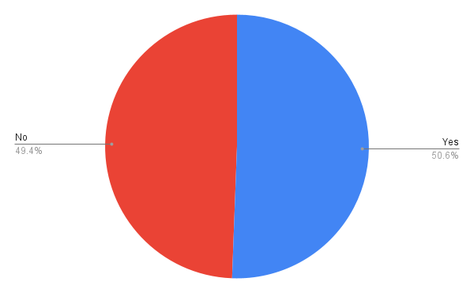

This folder will contain visualizations and charts based on SQL query results.

---

## Insight: Why This Chart Matters

Even in the tech industry — where access to healthcare is relatively high — nearly **half of respondents have not sought mental health treatment**.

This suggests that the real barriers may not be access, but rather **stigma**, **shame**, and a lack of safe spaces for disclosure.

It reinforces the need for **decentralized, anonymous systems** like HypnoNeuro that allow individuals to seek support without fear of judgment.

---

## Insight: Employer Support Isn’t Guaranteed

Only about one-third of respondents reported that their employer provides mental health benefits. Another third said “No,” and the rest weren’t even sure.

This shows a **systemic information gap**, lack of trust, or actual lack of access — all of which highlight the need for **private, user-controlled mental health systems** like HypnoNeuro, where support isn't dependent on your job.

---

## Insight: Many Don’t Even Know What Help Exists

A large portion of respondents — nearly one-third — reported that they **don’t know** what mental health care options their employer provides.

This lack of awareness isn’t just a communication issue — it reflects a deeper disconnect between systems and the people they claim to support.

Decentralized platforms like HypnoNeuro provide direct, user-controlled access that doesn’t depend on workplace clarity or HR gatekeeping.

---

## Insight: Fear of Supervisor Judgment Limits Openness

When asked if they feel comfortable discussing mental health with their supervisor, many respondents said **No** or **Some of them**, indicating hesitancy or fear of judgment.

This confirms a clear lack of psychological safety in the workplace, and strengthens the case for **anonymous, non-employer-linked support systems** like HypnoNeuro — where help is available without the need for uncomfortable disclosures.

---

## Insight: Coworker Stigma Remains a Barrier

When asked if they feel comfortable discussing mental health with their coworkers, many respondents said **No** or **Some of them** — mirroring the hesitation seen with supervisors.

This shows that stigma isn’t just vertical (top-down) but lateral — even peers may not feel safe. HypnoNeuro’s anonymous design eliminates social risk by giving users a private space to explore healing without fear of workplace judgment.

---

## Insight: Family History Doesn’t Guarantee Action

Even among respondents who reported a **family history of mental illness**, many had **not sought treatment** themselves.

This shows that awareness alone isn't enough — the system still fails to engage or earn trust from at-risk individuals. Platforms like HypnoNeuro must meet people where they are, offering care that is **private, stigma-free, and disconnected from clinical red tape**.

---

## Insight: Many Don’t Feel Protected by Anonymity

When asked if they felt protected by anonymity when seeking mental health care at work, a significant number of respondents said **No** or **Don’t know**.

This shows that even when systems claim to offer confidentiality, **people don’t trust it**. It underscores the importance of truly anonymous, decentralized solutions like HypnoNeuro — where identity is never tied to employer systems or HR records.

---

## Insight: Time Off for Mental Health Still Feels Risky

When asked how easy it would be to take mental health leave at work, many respondents said it would be **somewhat** or **very difficult**.

This shows that policies on paper may not translate into psychological safety in practice. HypnoNeuro’s value lies in letting people access care *without having to take time off, explain themselves, or face HR stigma.*

---

## Insight: Suicide Death Rates Reveal Deep Disparities

CDC data shows extreme differences in suicide rates based on sex, race/ethnicity, and age. For example, males die by suicide nearly **four times more often than females**, and American Indian/Alaska Native populations face the **highest rate** among all racial groups.

Older adults and young people alike show elevated risks, revealing that suicide isn’t confined to any one demographic. These disparities demand accessible, stigma-free, and culturally responsive support — which decentralized platforms like HypnoNeuro are uniquely positioned to provide.

---

### 📊 Chart: Mental Health Treatment Summary

This chart shows the distribution of responses to whether participants have sought mental health treatment. It highlights the high percentage of individuals who have **never received care**, despite reporting symptoms — supporting the urgent need for accessible, stigma-free options like HypnoNeuro.

